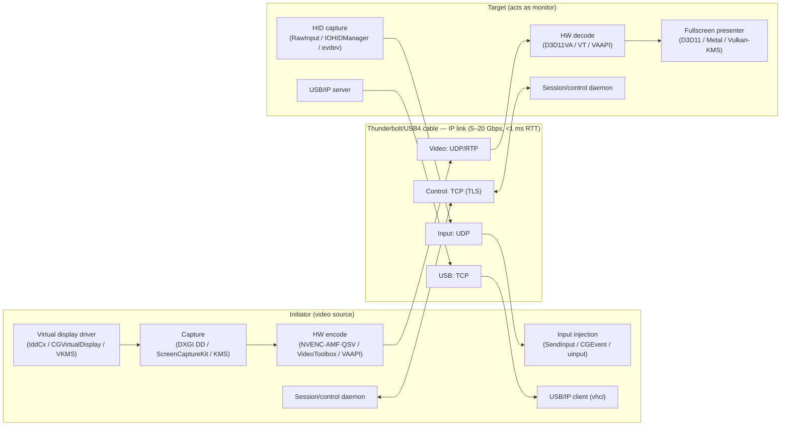

# ThunderLink — Design & Implementation Plan

Turn any Thunderbolt/USB4-equipped computer into a high-resolution external
monitor + input peripheral for another computer. Cross-platform
(macOS / Windows / Linux), software-only, open.

Roles:
- **Initiator** — the computer whose desktop is extended/mirrored (video source).
- **Target** — the computer acting as the monitor (video sink), whose
  keyboard/mouse/USB devices are redirected back to the initiator.

---

## 1. Why this is possible (and why it must be software streaming)

### 1.1 The hardware signal path is gone
Apple's Target Display Mode (2009–2014 iMacs) was **not** software: those
iMacs contained a hardware mux that switched the panel from the internal GPU
to a raw DisplayPort signal arriving on the Mini-DP/TB port (Cmd-F2). Apple
removed that mux with the Retina redesign; no modern Mac, PC laptop, or
all-in-one exposes a panel-level video input.

In USB4/TB3/4, DisplayPort travels as a *tunneled* protocol between a DP IN
adapter (fed by a GPU) and a DP OUT adapter (feeding a physical port). A host
OS has **no software access to tunneled DP traffic** — the tunnel terminates
in the USB4 router hardware. We cannot inject frames into the target's panel,
and we cannot snoop the initiator's DP output.

**Conclusion: the only universal path is**
`initiator GPU framebuffer → hardware video encoder → Thunderbolt IP link →
hardware video decoder → target GPU compositor → panel`.
This is exactly the architecture proven by Sunshine/Moonlight (<10 ms glass-
to-glass), Luna Display Mac-to-Mac mode, and Intel Thunderbolt Share.

### 1.2 The transport already exists, on all three OSes
USB4/TB defines host-to-host **IP networking**; every OS ships a driver that
exposes an ordinary Ethernet-like interface over the cable:

| OS | Driver / interface | Real throughput (iperf3) |
|---|---|---|
| Linux | `thunderbolt-net` (in-tree), `thunderbolt0` | 9–20 Gbps |
| macOS | Thunderbolt Bridge (built-in) | 10 Gbps negotiated, ~5–6 Gbps real TCP |
| Windows | TbtNet "Thunderbolt Bridge" adapter | ~9–10 Gbps |

Cross-OS links work (macOS↔Windows confirmed in the field). Point-to-point,
link-local, sub-millisecond RTT, zero configuration. This is our substrate:
**plain TCP/UDP sockets, portable everywhere, no kernel code of our own.**
Design target: 20 Gbps-class TB3/TB4 links (Linux already measures 16–20);
point-to-point only (one initiator, one target); no link encryption in v1.

Luna Display reports Thunderbolt transport dropping stream latency to 1–4 ms
vs ~25 ms on Wi-Fi.

### 1.3 Bandwidth headroom changes the quality game
Typical remote-desktop/streaming products budget 15–50 Mbps (Ethernet/Wi-Fi
constraints). Even the slowest TB bridge (~5 Gbps) gives us **100–500 Mbps**
for video — HEVC at those bitrates is visually lossless for desktop content,
and 4:2:0 chroma fringing on text largely disappears. Optional modes:

| Mode | Res/FPS | Approx. bitrate | Fits in 5 Gbps? |
|---|---|---|---|
| Efficiency (HEVC 4:2:0) | 4K60 | 40–80 Mbps | trivially |
| Quality (HEVC 4:2:0 10-bit) | 4K60 HDR | 100–200 Mbps | yes |
| Text-sharp (HEVC 4:4:4, NV/Intel only) | 4K60 | 150–300 Mbps | yes |
| Near-lossless fallback | 1080p60 RGB raw | ~3 Gbps | yes (macOS bridge only marginal) |

---

## 2. Prior art / competitive landscape

| Product | What it does | Gaps we exploit |
|---|---|---|
| Apple Target Display Mode | HW DP passthrough into iMac panel | Dead since 2014; Apple-only; no input/USB |
| **Intel Thunderbolt Share** (2024) | PC-to-PC screen share + KM + files over TB4/5 | Windows-only, proprietary, license-gated, caps at 1080p60, no extended-display (mirror-style control only) |
| **Luna Display** (Astropad) | Mac/PC → Mac-as-monitor, TB/Ethernet/Wi-Fi transport | Requires purchased dongle; closed; macOS target only |
| Duet Display | iPad/Mac as 2nd display | Closed, dongle/subscription, no Linux |
| spacedesk / Deskreen | Network display over LAN | Wi-Fi/Ethernet latency & bandwidth; no TB focus; weak input redirection |
| **Sunshine + Moonlight** | OSS game streaming: capture→HW encode→UDP→HW decode + input backchannel | Not a *display* (no virtual monitor integration, no EDID handshake, no USB redirect) — but the reference architecture for our media pipeline |
| Barrier/Deskflow, USB/IP, VirtualHere | Input sharing / USB-over-IP | No video; macOS USB client story is weak (see §7) |

ThunderLink = **Thunderbolt Share's wire + Target Display Mode's UX +
Sunshine's media engine**, cross-platform and open.

---

## 3. System architecture



### 3.1 Session lifecycle
1. **Link detection** — watch for a new Thunderbolt network interface
   (udev / NetworkConfiguration / WMI events). Assign link-local IPv6.
2. **Discovery** — mDNS/DNS-SD `_thunderlink._tcp` on the TB interface only
   (Avahi / Bonjour / Windows DNS-SD). Both ends announce role-capability.
3. **Pairing (first time)** — v1: none. The link is physically point-to-point;
   auth/encryption deferred (see §12). Target accepts the first inbound
   session; a UI confirm dialog lands with the tray app (M6).
4. **Negotiation** — target sends: panel EDID (native res, HiDPI/scale, HDR,
   refresh), decoder caps (codec/profile/levels), USB device list. Initiator
   replies: chosen codec/bitrate, virtual-display config.
5. **Bring-up** — initiator creates/configures its virtual display with the
   target's EDID → OS extends desktop → capture starts → stream begins →
   target goes fullscreen borderless.
6. **Teardown** — cable pulled or user exits: target returns to its own
   desktop; initiator destroys virtual display (windows migrate to primary).

### 3.2 Protocol channels (single design, all platforms)
- **Control** — TCP, length-prefixed bincode messages: Hello, Caps,
  StreamConfig, Start/Stop, EDID blob, Heartbeat(1 s), Error. No TLS in v1
  (P2P cable); framing leaves room for a crypto layer later.
- **Video** — UDP, RTP-ish framing we control: seq, frame-id, fragment
  index, FEC group (Reed-Solomon optional — TB links are nearly lossless,
  so start without FEC), NACK-based retransmit, IDR-request message.
  Bitrate adaptive via RTCP-style receiver reports (RTT + loss + jitter).
- **Input** — UDP, timestamped HID reports (absolute pointer + buttons +
  scroll + key events), ~125–1000 Hz. No ACKs; latest-state-wins.
- **USB** — TCP, USB/IP protocol (v1.1.1) verbatim where possible so we can
  reuse kernel drivers; our own framing layer adds auth/encryption.

---

## 4. Initiator side — per-platform plan

### 4.1 Virtual display (the "monitor" the OS sees)
The critical trick: the virtual display is programmed with the **target
panel's EDID**, so macOS/Windows/Linux natively pick the right resolution,
HiDPI scaling, HDR and refresh — the desktop "just looks right".

| OS | Mechanism | Notes |
|---|---|---|
| Windows | **IddCx** (Indirect Display Driver, UMDF user-mode) | Mature, documented. Fork/derive from `VirtualDrivers/Virtual-Display-Driver` (MIT): HDR, custom EDID, 8K, 60–500 Hz, ARM64. Needs EV-signed driver package (§10). |
| macOS | **CGVirtualDisplay** private CoreGraphics API | What BetterDisplay uses: arbitrary res, HiDPI, HDR, multiple displays, Intel+Apple Silicon. Risk: private API can break per macOS release — isolate behind an abstraction, ship a fallback (mirror existing display instead of extending). No kext needed. |
| Linux | **VKMS** (in-tree) or **EVDI** (DisplayLink's DKMS) | VKMS: zero-install but limited connector/EDID control. EVDI: full userspace control, used by Sunshine. Wayland: wlroots compositors also allow headless outputs via `wlr-output-management`. Ship both: prefer EVDI, fall back to VKMS. |

### 4.2 Capture
| OS | API | Format |
|---|---|---|
| Windows | DXGI Desktop Duplication (or IddCx swapchain frames directly — zero extra copy) | D3D11 texture, NV12 via GPU |
| macOS | ScreenCaptureKit (`SCStream`, captures the virtual display by ID) | IOSurface → VideoToolbox, zero-copy |
| Linux | KMS/DRM plane grab (GBM) or PipeWire (`xdg-desktop-portal` / wlroots screencopy) | dmabuf → VAAPI, zero-copy |

### 4.3 Encode (priority order per OS)
- Windows: NVENC → QuickSync → AMF → (x264 sw)
- macOS: VideoToolbox (HEVC; 10-bit for HDR)
- Linux: VAAPI → NVENC → AMF → Vulkan Video → sw

Codec default: **HEVC Main10** (HDR-capable, universal HW decode since
~2016). H.264 High as compatibility fallback. **HEVC 4:4:4** mode when both
ends support it (NVIDIA/Intel GPUs on Windows; decode support varies —
negotiate at handshake). AV1: decode-only on Apple silicon, no 4:4:4 HW
encode anywhere yet — revisit later.

### 4.4 Input injection
- Windows: `SendInput` (mouse+kbd) — session-0 caveats for secure desktop
  (UAC prompts unreachable; acceptable, document it).
- macOS: `CGEventPost` — requires Accessibility + Input Monitoring
  entitlements (TCC prompts on first run).
- Linux: `uinput` virtual devices (works under X11 **and** Wayland —
  inject at kernel level, bypasses compositor remoting restrictions).

Pointer model: absolute coordinates mapped to the virtual display's region
of the initiator desktop (multi-monitor aware). Hardware cursor on target;
cursor-shape changes streamed as metadata (PNG sprites or shape IDs).

---

## 5. Target side — per-platform plan

### 5.1 Decode + present
| OS | Decode | Present |
|---|---|---|
| Windows | D3D11VA / Media Foundation | D3D11 swapchain, borderless fullscreen, MPO where possible |
| macOS | VideoToolbox decode | Metal layer-backed fullscreen view (CAMetalLayer) |
| Linux | VAAPI / NVDEC | Vulkan or direct KMS lease/atomic modeset |

Presenter requirements: vsync-locked, minimal queue depth (present latest
frame, drop stale — never buffer), fullscreen exclusive-ish mode hiding all
local UI, ESC-corner gesture or hotkey to release/exit.

### 5.2 HID capture (target's keyboard/mouse → initiator)
- Windows: Raw Input + low-level hooks while presenter is focused.
- macOS: `IOHIDManager` / `CGEventTap` (needs Input Monitoring permission).
- Linux: `evdev` grab (`EVIOCGRAB`) on input devices.
Keyboard LED state (CapsLock etc.) flows back from initiator → target.

### 5.3 EDID provider
Read the target panel's real EDID:
- macOS: IOKit `IODisplayConnect` / display info.
- Windows: WMI `WmiMonitorID` / EDID from registry.
- Linux: `/sys/class/drm/*/edid`.
If unreadable, synthesize a standard EDID matching the panel's native mode.

---

## 6. Audio (v1.1)
Initiator creates a virtual audio device (BlackHole/Loopback on macOS,
VB-Cable-style on Windows, PipeWire/Pulse sink on Linux) → Opus encode →
same UDP channel family → target plays locally. 48 kHz stereo Opus @
128–256 kbps. Lip-sync via shared RTP timestamps with video.

## 7. USB device redirection (target's ports serve the initiator)

Architecture: **USB/IP protocol**, target = server, initiator = client.

| Direction | Linux init. | Windows init. | macOS init. |
|---|---|---|---|
| Target shares a device | in-kernel `usbip-host` (Linux target); `usbip-win` stub or our user-space re-impl (Windows target); user-space via IOKit USB (macOS target, VirtualHere proves feasibility) | in-kernel vhci | `usbip-win2` (vadimgrn) signed client driver | **hard**: no modern virtual USB host controller; `usbip-osx` is stale/kext-era |

Plan:
- **v1**: HID class (keyboard/mouse/trackpad/gamepad) is **not** done via
  USB/IP at all — it rides the low-latency input channel (§4.4). This
  covers the 95% use case with zero driver work.
- **v2**: full USB/IP on Linux+Windows initiators. macOS initiator gets
  device-class shims where possible (mass-storage via file-level sharing,
  serial via pty-over-TCP) — honest degradation, no fake passthrough.
- Webcams/mics/isochronous devices: explicitly out of scope (nobody does
  iso over USB/IP reliably).

---

## 8. Codebase structure (Rust core + thin platform shims)

```
thunderlink/
├── core/                  # pure Rust, 100% shared
│   ├── proto/             # control msg schema, RTP framing, input packets
│   ├── session/           # session state machine, capability negotiation
│   ├── net/               # link detection, mDNS, channel I/O, adaptive bitrate
│   └── codec/             # codec-agnostic frame/packet traits
├── platform/
│   ├── windows/           # IddCx driver (C++/WDF subproject), DXGI, MF, SendInput, RawInput
│   ├── macos/             # CGVirtualDisplay, ScreenCaptureKit, VideoToolbox, CGEvent (Swift/Cg FFI)
│   └── linux/             # EVDI/VKMS, KMS/PipeWire, VAAPI, uinput, evdev
├── app/
│   ├── daemon/            # background service (both roles live here)
│   ├── ui/                # tray app (egui/Tauri): pair, pick role, stats overlay
│   └── cli/               # headless control + scripting
└── docs/
```

- One binary runs on both ends; role is chosen per-session ("Use this
  machine as a display" / "Extend to the other machine").
- FFI kept at platform edges; all protocol logic shared and fuzz-tested.
- Video pipeline via platform-native APIs directly (Sunshine's approach) —
  GStreamer only as a Linux fallback path, not a dependency.

---

## 9. Latency & performance budget (target: < 20 ms glass-to-glass)

| Stage | Budget | Lever |
|---|---|---|
| Capture | 2–6 ms | zero-copy GPU surfaces |
| Encode | 2–4 ms | HW encoder, low-delay GOP, no B-frames |
| Network | < 1 ms | TB point-to-point; jumbo frames optional |
| Decode | 2–5 ms | HW decoder |
| Present | 0–8 ms | vsync latest-frame-only queue |
| Input path | 2–5 ms | UDP, 500 Hz reports |

Validation harness: initiator renders a timestamp pattern; target
photodiode/camera or self-measured present timestamps logged to CSV.

---

## 10. Delivery friction (plan for these early — they gate shipping)

1. **Windows driver signing** — IddCx driver needs EV code-signing cert +
   attestation signing (~$200–400/yr). Start cert procurement in M1.
   Unsigned dev builds need test-signing mode.
2. **macOS notarization + entitlements** — app must be notarized; Screen
   Recording, Accessibility, Input Monitoring TCC grants required (UX for
   first-run permission walkthrough). CGVirtualDisplay is private API —
   no Mac App Store, distribute direct.
3. **Linux packaging** — EVDI DKMS module install friction; ship
   deb/rpm/AppImage + clear Secure Boot signing guidance (or prefer VKMS
   path when EVDI unsigned fails).
4. **HDCP** — protected content (Netflix etc.) will black-screen in capture.
   Same limitation as Thunderbolt Share; document, don't fight it.

---

## 11. Milestones

| # | Milestone | Deliverable / exit test |
|---|---|---|
| M0 | **Transport PoC** | Two machines, `iperf3` + RTT over TB bridge on all 3 OS pairs (mac↔mac, win↔win, linux↔linux, mac↔win, mac↔linux); link-local auto-IP + mDNS discovery working |
| M1 | **Mirror streaming, one OS pair** (pick Linux↔Linux — fewest signing hurdles) | 1080p60 HEVC mirror of primary display, <30 ms, fullscreen target app |
| M2 | **Virtual display = extended desktop** on Linux (EVDI) + Windows (IddCx) | OS shows a real 2nd monitor with target's EDID; windows draggable onto it |
| M3 | **Input backchannel** | Target kbd/mouse controls initiator's extended desktop, <10 ms feel; cursor-shape sync |
| M4 | **macOS both roles** (CGVirtualDisplay + ScreenCaptureKit + VT) | Laptop→iMac 5K60 stream, HiDPI correct, TCC flow polished |
| M5 | **Cross-OS matrix** | All 6 directed OS pairs negotiable (codec fallbacks where needed) |
| M6 | **UX hardening** | Tray UI, role picker, auto-reconnect, stats overlay, connection confirm dialog |
| M7 | **Audio + polish** | Opus audio path; bitrate adaptive; HDR flag day if ready |
| M8 | **USB/IP v2** | Linux/Windows initiators attach target's USB storage/serial devices |
| M9 | **1.0 packaging** | Signed installers: Win (EV-signed driver), macOS (notarized dmg), Linux (deb/rpm/AppImage + DKMS) |

Suggested build order for fastest visible progress: M0→M1→M3 (wow demo:
mirror + control) then M2 (true monitor) then platform ports.

---

## 12. Top risks

| Risk | Impact | Mitigation |
|---|---|---|
| macOS CGVirtualDisplay breaks in a future macOS | macOS initiator can't extend (mirror still works) | Abstraction layer; monitor BetterDisplay; fallback mode |
| TB bridge capped ~10 Gbps (esp. macOS real ~5) | Limits exotic modes (raw RGB 4K) | Bitrate ladder; HEVC always fits; document |
| Windows driver signing cost/time | Blocks Win extended display | Start EV cert at M1; mirror mode works driverless meanwhile |
| Wayland capture fragmentation | Linux target/initiator UX varies | Prefer KMS/PipeWire portal; per-compositor quirks list |
| Isochronous USB (webcams) | Can't redirect | Explicitly out of scope; say so in docs |
| HDCP black screens | User confusion | Detect + in-app notice |
| No encryption/auth in v1 | Malicious host on the cable could inject/record | Physical P2P mitigates; threat model documented; crypto layer planned v2 |

## 13. Open questions
- QUIC vs raw UDP for the video channel? (QUIC gives crypto+congestion for
  free but adds latency/complexity; TB link is lossless enough that raw
  UDP + TLS control is likely better. Decide at M1 with measurements.)
- Can we opportunistically upgrade to >10 Gbps on TB4/5 links (Linux seems
  to reach 16–20 Gbps; Windows/macOS cap at 10)?
- Multiple targets (one initiator → two machines-as-monitors)? Protocol
  supports it trivially; GPU encode sessions are the real limit. v2.
